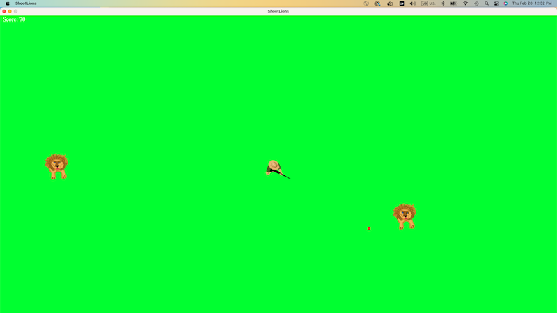

# Shooting Lions Game

This 2D game was adopted from a scene in the TV Show 1923 Two characters were on top of a tree and defending themselves against hungry lions game uses keyboard arrow keys to rotate the character clockwise(VK-right) and counter-clockwise(VK-left) VK-space is used for shooting bullets to lions, which randomly appear on the panel from different angles




## Here is the [Java Documentation](https://github.com/mivehk/ShootLions/tree/Initial_H/doc).
## You can compile and package the game with this Jenkins pipeline:

```bash
pipeline {
    agent any

    stages {
        stage('Clone Repository') {
            steps {
                git branch: 'Initial_H', url: 'https://github.com/mivehk/ShootLions'
            }
        }

        stage('Compile') {
            steps {
                // Compile Java files in the src directory
                sh 'mkdir -p out' // Creates an output directory if not present
                sh 'javac -d out $(find src -name "*.java")'
            }
        }

        stage('Package') {
            steps {
                sh 'echo "Main-Class: ShootLions" > MANIFEST.MF'
                // Package compiled files into a JAR
                sh 'jar cvfm shootlions2d-game.jar MANIFEST.MF -C out .'
            }
        }

        stage('Archive Artifacts') {
            steps {
                // Archive the JAR file
                archiveArtifacts artifacts: 'shootlions2d-game.jar', allowEmptyArchive: true
            }
        }
    }
}
```


